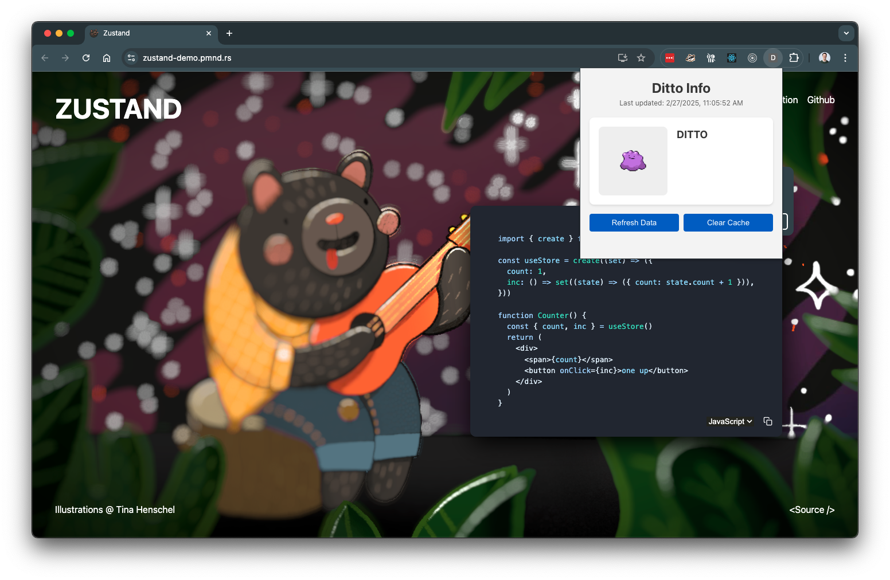

# chrome-extension-zustand

A proof-of-concept for using [Zustand](https://zustand.docs.pmnd.rs/) and
the [Storage API](https://developer.chrome.com/docs/extensions/reference/storage/) as a single source of truth
in [Chrome Extensions](https://developer.chrome.com/docs/extensions/).

This demo extension fetches data from [pokeapi.co](https://pokeapi.co/) and displays it in a popup.

#### Built with

- [Vite](https://vitejs.dev/)
- [@crxjs/vite-plugin](https://crxjs.dev/vite-plugin) ⭐
- [React](https://react.dev/)
- [TypeScript](https://www.typescriptlang.org/)
- [Zustand](https://zustand.docs.pmnd.rs/)
- [Immer](https://immerjs.github.io/immer/)
